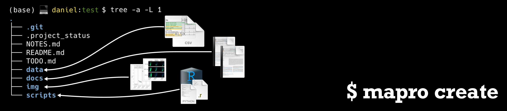

# I am trying to be more organized

If this is something you're telling yourself from time to time and if you're like me shuffling between several different projects during your daily routine this simple collection of scripts might help you keep track of things more easily.
Time and reproduceability are the essence of every research project. Contracts finish and data is handed over to the next person in line. A well organized project folder is worth a lot when you have to continue the work of others.
The main idea of the scripts collection is to setup a folder and file structure that captures the necessary data and information in a reproducable fashion. Usually my daily work involves performing experiments, capture results from these experiment (images, tables, text files etc.), store them as data and then evaluate this data using some sort of scripts written e.g. in R or Python. While being in this process I have to take notes and write down further ToDos to keep track of what I was doing and what should be done in the future.
Ideally all this should be under version control to keep track of changes that happend over time allowing you to go back to previous notes or versions of scripts. 
Automating half of the things that I mentioned above is already a huge help and that's why I wrote these scripts to organize a project and keep track of what I have started over the time.

## Dependencies

The scripts are limited to Unix operating systems.

Tested on:

- MacOS 13.6
- Ubuntu 24.04

**Dependencies**:

- bash
  - GNU bash, version 5.2.15(1)-release (x86_64-apple-darwin22.5.0)
- [GIT](https://git-scm.com) - version control of your data
  - MacOS - git version 2.39.3 (Apple Git-145) 
- [SQlite](https://www.sqlite.org/index.html) - managing the project database
  - version 3.37.0
- [pandoc](https://pandoc.org) - the swiss army knife for document conversion
  - version 3.1.12.2 (installed with brew)
- [TeX live](https://tug.org/texlive/) - TeX document production system required by pandoc for PDF
  - 3.141592653 (TeX Live 2024)

 `bash`, `GIT` and `SQlite3` should be preinstalled on most of the unix systems.

## Install 

**mapro:**

I would recommoned to link the helper scripts to one of the `bin/` directories in your path e.g. `~/.local/bin` on MacOS. Following is an example of how I have it setup:

```bash
(base) 💻 daniel:~ $ cd ~/.local/bin
(base) 💻 daniel:bin $ ln -s /Users/daniel/Documents/create_project/mapro ./
```

Make sure to use the full path to the bash scripts.

**pandoc:**

`mapro` uses pandoc to convert your NOTES.md and README.md files to HTML or PDF files easier sharing of the files with less techsavvy folks out there. I have installed pandoc using [brew](https://brew.sh):

```
$ brew install pandoc
```

For other ways of installing `pandoc` check the [website](https://pandoc.org/installing.html)

**TeX live:**

I have installed `TeX live` according to the [install instructions](https://tug.org/texlive/quickinstall.html).
During the install I specified to install the `small` scheme which corresponds to `BasicTeX`. I strongly recommend to install this version as the full install will take severl GB of your storage.

```
$ perl ./install-tl --no-interaction --scheme=small
```

Missing packages for `TeX` can be installed using the package manager:

```
$ tlmr install <package>
```

Depending on where you have installed it you might have to run it with `sudo`. The package `framed` is not included in the `BasicTeX` install but is needed if you write code snippets in your markdown files.

## My generic, all-purpose folder structure

```bash
(base) 💻 daniel:create_project $ tree test -a -L 1
test
 |- .git/                (version control)
 |- .project_status      (active, complete, previous name)
 |
 |- README.md            (what this project is about)
 |- NOTES.md             (what has been done)
 |- TODO.md              (what still has to be done)
 |
 |- data/
 |  └── collected data   (expression, phenotypes...)
 |
 |- docs/
 |  └── documents        (protocols, literature...)
 |
 |- img/
 |  └── images           (png, jpg, tiff...)
 |
 └──scripts/
    └── scripts          (bash, R, python, ipynb...)
```

The universal folder structure that I usually end up with looks like the one above: 

- A notes file (`NOTES.md`) to document the progress and methods
- A readme file (`README.md`) describing the project
- A file storing the todos (`TODO.md`)

Common folders that I end up using is:

- `data/` to store generated data (mostly tables for me)
- `docs/` that stores literature and protocols/powerpoints
- `img/` that stores pictures and images taken during experiments
- `scripts/` which will be the home for any sort of script that allows analysis of the generated data

The hidden file `.project_status` is home for some meta-data that will help to keep track of changes of the project folder. The `.git/` is storing the version control data and is managed by `git`.

## Creating a project

A gentle reminder at this point that every project generated with `create_project` will be version controlled via `git`. It is therefore not recommended to create projects within projects. If you still need to do this the `.gitignore` file can be used to exclude the project folder from the higher level `git` repository.

```bash
(base) 💻 daniel:create_project $ mapro

mapro is there to help you organize your projects.
Create a generic folder structure and files to document and
keep track of your porjects.

usage:  mapro <function> -h

Available helper scripts:

        create   - creates a new project with folder structure
                   and files to keep track of things.
        check    - overview of created projects to keep track
                   of what you're doing
        edit     - editing an existing project
                   (e.g. rename, move, change project status)
        remove   - removes an existing project
                   (completely deletes everything)
        activate - lets you edit contents in the project folder.
```

The first thing you might want to do is creating your first project folder. Naviagate to the directory in which the project will be stored and execute `mapro create`. 

```bash
(base) 💻 daniel:create_project $ mapro create

This script will create a project folder structure in the current directory.

	Usage: create -p project_name
```

As input only the project name has to be supplied. No spaces or weird extra symbols are allowed in the project name. Sorry... \
Upon first run the SQlite database will be generated. The default storage of the database is in the $HOME folder of the user and the file is called `.projects.db`. A single table will be generated in the database with the following schema:

```SQL
DB_FILE=$HOME"/.projects.db"

SQL_CREATE_TABLE="CREATE TABLE projects (
                    uid TEST PRIMARY KEY,           <- unique identified
                    name TEXT NOT NULL,             <- name of the project
                    description TEXT,               <- a short and witty description
                    tags TEXT,                      <- descriptive tags
                    location TEXT NOT NULL,         <- the path to the project
                    status TEXT NOT NULL,           <- current status 
                    date DATE DEFAULT CURRENT_DATE  <- the date of creation
                  );"

sqlite3 "$DB_FILE" "$SQL_CREATE_TABLE"
```

The following part of the script will guide you through the generation of the project folder structure:


1. Where are you. Cofirm that you want to generate a new project here:

```bash
(base) 💻 daniel:create_project $ mapro create -p test
 [info] You're in:      /Users/daniel/Documents/create_project/
 [info] Project name:   test
 [info] Project dir:    /Users/daniel/Documents/create_project/test/

Create folder/file structure? (y/n)
```

2. Folders and files are being created. A (short) description can be added at this point. It will be stored automatically in the README.md file and included in the general project database file (`~/.projects.db`):

```bash
 [info] Creating the folder/file structure.
 [info] ✔  Creating the folders.
 [info] ✔  Creating the files.
 [info] ✔  Creating the file content.

Add description? (y/n)
```

3. Adding description and tags (stored in README.md). Tags can be later used for searching projects:

```bash
Description (return will enter): 

 Testing the project managment tool.
Tags (comma seperated): 

 test,test2
```

4. Optionally you can already add todos for the new project. Todos will be stored as bullet point list in the TODO.md file.

```bash
Do you want to add any ToDos? (y/n) y

Empty TODO exits the entry:
TODO: One thing
TODO: And the other thing
TODO: 
```

5. After all this 'git' is run to initialize the repository, stage all the new and changed files and then commit everything as the very first version:

 ```bash
 [info] Running git init, git add and git commit

Initialized empty Git repository in /Users/daniel/Documents/create_project/test/.git/
[main (root-commit) 5055ef7] Project test intialized and tracked
 4 files changed, 12 insertions(+)
 create mode 100644 .project_status
 create mode 100644 NOTES.md
 create mode 100644 README.md
 create mode 100644 TODO.md

 [info] Done. ✔
 ```

## Editing files in project folders

Changing direcotories to add notes or todos can be tedious if you have to jump between projects. That's why I wrote mapro activate get to the project folders more easily.


```bash
(base) 💻 daniel:create_project $ mapro activate

This script let's you edit your projects data.

Usage: activate -p <project name>
        -p: project name
        -n: open project NOTES.md for editing
        -t: open project TODO.md for editing
        -d: cd into project directory
        -e: change the editor <vim | nano>
```

- Easily edit `NOTES.md` and `TODO.md` of created projects:

```bash
(base) 💻 daniel:create_project $ mapro activate -p test -n
```

This will open the `NOTES.md` file in your editor of choice (of course that's vim).

```bash
(base) 💻 daniel:create_project $ mapro activate -p test -t
```

This will let you add todos to `TODO.md`.

If you want to do more things than adding notes or todos you can `activate` the project directory in a subshell:

```bash
(base) 💻 daniel:create_project $ mapro activate -p test -d
   [info]       You are now in: /Users/daniel/Documents/create_project/test
   [info]       Exit subshell with 'CTRL + D' or type 'exit'
(Project: test)  mapro : 
```

Make sure to `exit` the subshell after finishing your editing. I tried to make it obvious for the user that a different `shell` has been started by adjusting the `$PS1` variable.

## Keeping track of your projects

Creating a defined folder structure with constant files for tracking the progress of a project is one important thing. The other important thing is to keep track of those project folders that were generated using the `create_project` script. As already mentioned above meta-data of each project is stored in a SQlite database file in the home directory named `~/.projects.db`.
To manage the projects created with `create_project` the following scripts are available:

- **check**
- **edit**
- **remove**

### - mapro check

The help you get if you ask for it:

```bash
(base) 💻 daniel:create_project $ mapro check -h

This script will check created projects.

Usage: check_projects
        -g: will check 'git diff' for unstaged changes in projects.
        -l: will list all projects
        -a: will list all active projects
        -t: will list projects with matching tag/tags <tag1,tag2>
        -n: will list projects with matching names <name>
        -i: will check if projects are where they are supposed to be
        -v: verbose
```

The standard output that you get:

```bash
(base) 💻 daniel:create_project $ mapro check_projects
 [info] Total number of projects:        1
        ___________________________________
 [info] Active projects:                 1
 [info] Suspended projects:              0
 [info] Completed projects:              0
```

All further outputs are presented via `less`. In case you have many projects you can easily search for one in the list that was generated.

- All the projects that are managed with this script:

```bash
(base) 💻 daniel:create_project $ mapro check -l
   [active]     test    /Users/daniel/Documents/create_project/test/
```

- All **active** projects:

```bash
(base) 💻 daniel:create_project $ mapro check -a
   [active]     test    /Users/daniel/Documents/create_project/test/
```

- Run `git diff` on all projects:

```bash
(base) 💻 daniel:create_project $ mapro check -g
up-to-date ✔    test    /Users/daniel/Documents/create_project/test/
```

If there are unstaged file changes in one of the projects `mapro check -g` will automatically ask you if it should run `git add .` on those projects. Below is a bit of `bash` piping for doing this manually

```bash
(base) 💻 daniel:~ $ mapro check -g | grep -E 'has-changes' | \
                                               cut -f3 | \
                                               while read l; do git -C $l add .; done
```

- Search projects with a certain tag. The search is automatically fuzzy and will retun results that are similar to the tags entered.

```bash
(base) 💻 daniel:create_project $ mapro check -t test
   [active]     test    test    /Users/daniel/Documents/create_project/test/
```

- Similarly one can search for a project name. Fuzzy search is also enabled here by default.

```bash
(base) 💻 daniel:create_project $ mapro check -n test
   [active]     test    /Users/daniel/Documents/create_project/test/
```

- Check if all the paths to the different projects exist. More checks will have to be implemented for this.

```bash
(base) 💻 daniel:create_project $ mapro check -i
 [info] All fine. ✔
```

This will exit without anything if all is well! Running it with `-v` flag will spit out more information.

### mapro edit

Not everything is set in stone. Therefore, you here have the once in a lifetime chance to change your past mistakes.

```bash
(base) 💻 daniel:create_project $ mapro edit -h

This script will edit a project. This includes renaming,
moving to new directory and changing the status

Usage: edit -p <old_project_name> -n <new_project_name>
Usage: edit -p <project_name> -m </path/to/new/location>
Usage: edit -p <project_name> -s <active | complete | suspended>
        -p: Project to be renamed.
        -n: New project name (no spaces allowed)
        -m: New project location (no spaces allowed)
        -s: Change the project status (active, complete, suspended)
        -d: Dry running to see whats about to happen.
```

The script has a dry-run (-d) option to take away the anxiety which can be caused by permanent change:

```bash
(base) 💻 daniel:~ $ mapro edit -p test -n test2 -d
Dry-run, the following will be executed when running without -d

 [info] Old dir: /Users/daniel/Documents/create_project/test/
 [info] New dir: /Users/daniel/Documents/create_project/test2/

 [info] Command: sqlite3 /Users/daniel/.projects.db "UPDATE projects SET name = 'test2', location = '/Users/daniel/Documents/create_project/test2/' WHERE name = 'test';"
 [info] Command: mv /Users/daniel/Documents/create_project/test/ /Users/daniel/Documents/create_project/test2/
 [info] Command: echo "old_name:  test" >> /Users/daniel/Documents/create_project/test2/.project_status
 [info] Command: echo "  change_date: 2024-03-28 14:34:04" >> /Users/daniel/Documents/create_project/test2/.project_status
```

You get the information from where to where the directory is being moved. Removing the `-d` flag will permanently change everything.
To keep track of what you've just done the old name of the project will be stored in the `.project_status` file together with the date inside the project.

### mapro remove

Permanently removes the indicated project (project folder and entry in ~/.projects).

```bash
(base) 💻 daniel:create_project $ mapro remove

This script will remove created projects.

Usage: remove -p <project name>
        -p: project name
        -d: dry running this
```

Again to remove anxiety you can dry-run (`-d`) the process. You get the edited ~/.projects file as output and the project name and folder which is going to be deleted.

```bash
(base) 💻 daniel:~ $ mapro remove -p test -d
Dry-run, the following will be executed when running without -d: 

 [info] Project:        test
 [info] Project dir:    /Users/daniel/Documents/create_project/test/
 [info] Command:        rm -r /Users/daniel/Documents/create_project/test/
 [info] Command:        sqlite3 /Users/daniel/.projects.db "DELETE FROM projects WHERE name = 'test';"
```

